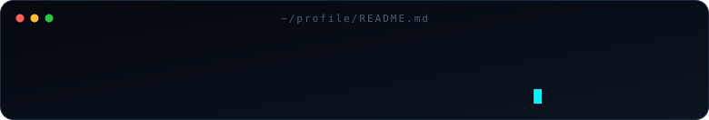
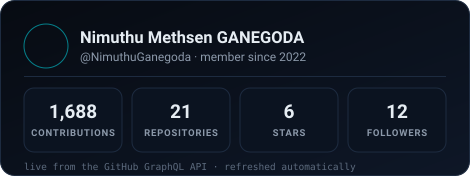
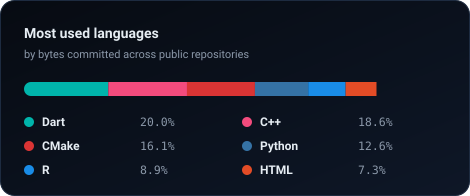
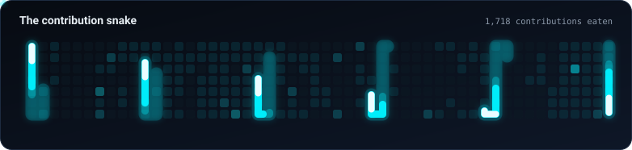

**Cybersecurity undergrad · SOC engineer intern · systems & tooling builder**

---

## 🛰️ Latest Developments

| When | What moved |
|:--|:--|
| **Sep 2026** | **NeOS** — kept pushing the snapshot-gated Arch distribution: Btrfs snapshot gating, automated NVIDIA/AMD/Intel tuning, and hardened defaults (UFW, systemd sandboxing, Secure Boot helpers). |
| **Sep 2026** | **Mirai-Koyomi** — new asynchronous **FastAPI** service serving accurate Sri Lankan public, bank and mercantile holiday data, cached in **Redis**. |
| **Sep 2026** | **riko_project** — published the public build; now the most-starred repository on the account. |
| **Aug 2026** | **World History Archive** — rebuilt as a high-performance static **Next.js** knowledge platform (Go toolchain) with interactive maps and timelines for kingdoms, monarchs and archaeological sites. |
| **Aug 2026** | **Kitsune-Gaze** — a gothic-styled personal data-breach exposure tracker (React/Vite frontend, FastAPI backend). |
| **Jul 2026** | **ride-hailing-dissection** — APK-level binary dissection of ride-hailing app architectures (Bolt, Grab, Uber, PickMe). |
| **Apr 2026** | Joined **MillenniumIT ESP** as a **Managed Security Services Engineer (intern)** — 24/7 SOC monitoring, incident triage, threat detection and vulnerability assessment for enterprise clients. |
| **Feb 2026** | Took over database architecture for **BusGo** — PostgreSQL/Supabase schema design, data integrity and real-time query performance. |

---

## 👨‍💻 About Me

I'm a **final-year BSc Computer Science (Cybersecurity)** student at Edith Cowan University, and I spend my days where **security meets systems engineering**.

- 🛡️ **By day:** triaging security events and incidents in a live SOC at **MillenniumIT ESP**, learning how detections are tuned, escalated and measured in the real world.
- 🛠️ **By night:** re-engineering the web — reverse engineering app binaries, porting Unix tooling to Windows, and shipping an Arch-based desktop OS.
- 🗄️ **In between:** designing the PostgreSQL/Supabase backbone of **BusGo**, a Sri Lankan bus-transit ecosystem with AI-powered ETAs.
- 🇯🇵 **North star:** postgraduate study in cybersecurity and a career in an international security environment — Japan is the goal.

---

## 🚀 Current Projects

### 💠 Eien-no-Kiroku (Eternal Record)
> **AI referencing tool.** Next-generation, AI-powered referencing that brings order to academic research: smart DOI/ISBN/URL detection, deep PDF parsing, LLM verification, and export to BibTeX, APA, MLA and more.

### 📅 Mirai-Koyomi
> **Holiday API.** Asynchronous FastAPI service with Redis caching that serves accurate Sri Lankan public, bank and mercantile holiday data.

### 🐧 NeOS (Next Evolution Operating System)
> **Arch Linux distribution.** A curated, snapshot-based Arch desktop engineered for predictable behaviour, stability and a refined KDE Plasma 6 experience.

### 👁️ Kitsune-Gaze
> **Breach tracker.** A sleek, gothic-inspired tool for tracking down personal data-breach exposure, built on a React/Vite frontend and FastAPI backend.

### 🔮 riko_project
> **Public release.** The public version of the Riko Project — the most-starred repository on my account.

### 📖 Codex of Faith
> **Open-source archive.** Documenting the foundational beliefs, histories, practices and stories of the world's major religions, served through a React + TypeScript app.

### 🕵️ ride-hailing-dissection
> **Binary analysis.** Technical dissection of ride-hailing app architectures (Bolt, Grab, Uber, PickMe) through APK binary analysis.

### 🔐 Tailscale Client for Windows
> **Windows client.** A modern, high-performance WinUI 3 Tailscale client — multi-account management, QR auth, and a visual network map.

### 🌸 EasyVtuber
> **Browser VTubing.** A 100% browser-based VTubing app built on Talking-head-anime 3, with WebGPU/WebGL acceleration and no heavy local backend.

### 🚌 BusGo: Online Bus Travelling Management
> **Database + transit ecosystem.** Real-time bus tracking, passenger and driver mobile apps, AI-powered ETA prediction and emergency triage, plus an admin dashboard.

### 📡 ZeroAir (Aether)
> **Open AirDrop implementation.** Windows ⇄ iPhone/Android transfers via Apple AirDrop and Google Quick Share protocols, with continuous background discovery.

### 🌐 Rosetta-Browser
> **Browser migration + forensics.** Bridges Blink, Gecko and WebKit — cross-engine profile translation, an extension "Rosetta", and forensic session continuity with secure DPAPI/Libsecret handling.

### 🤖 PilotHub
> **Unified AI interface.** One Python interface for ChatGPT, DeepSeek and Grok, with key routing and a pluggable provider architecture.

### 🏛️ World History Archive
> **History knowledge platform.** Static Next.js platform for cataloguing and visualising kingdoms, monarchs and archaeological sites on interactive maps and timelines.

### 🖨️ Sane-Windows
> **C systems work.** A port of the SANE core and WIA backend so Windows applications can talk to SANE scanners.

<b>🗂️ More repositories worth a look</b>

- **SpotFreedom** — Rust SpotX-style patcher for the Spotify desktop client
- **CMDifyYourFiles** — recursive file/audio/video conversion & encoding automation for Windows and Linux
- **Inazuma-Ghost-Toolbox** — Windows restoration and de-bloating toolkit (Legacy Update + KMS activation)
- **CleanSlate** — cross-platform bootstrap scripts for a clean dev environment
- **legacy-fix** — vetted, confirm-before-you-act repair of legacy Windows XP/7 software and drivers
- **distributed-systems-labs**, **machine-learning-data-viz-r-labs**, **object-oriented-cpp-labs** — coursework labs

---

## 🛠️ The Toolkit

**Languages**

**Web & App**

**Security & Forensics**

**Infrastructure & Data**

**Hardware & Tinkering**

---

## 📊 GitHub Stats

> Every card below is generated from the GitHub GraphQL API by
> [`scripts/generate-profile-stats.js`](scripts/generate-profile-stats.js) and committed to
> `assets/` four times a day — no third-party stats host required.

| Overview | Streak |
|:---:|:---:|
|  |  |

---

## 🐍 Contribution Snake

The snake, the heatmap and every card above are rendered locally from the GitHub GraphQL API — no
third-party stats host to go dark. Generated by
[`scripts/generate-profile-stats.js`](scripts/generate-profile-stats.js) and refreshed by the
[Profile Metrics workflow](.github/workflows/profile-metrics.yml).

---

## 🎓 Education

- 🎓 **Edith Cowan University** – BSc in Computer Science (Cybersecurity) · *final year, completing 2026*
- 🎓 **Edith Cowan College** – Diploma in Computer Science
- 🎓 **Australian College of Business and Technology** – Foundation of Computing
- 🏫 **Lyceum International School** – Cambridge A-Levels (Computer Science)

**Certifications**
- 🏅 Advent of Cyber 2025 — TryHackMe
- 🏅 IT Security Foundations: Network Security — LinkedIn Learning

---

## 📈 Currently

| 🔭 Working on | 🌱 Learning | 🎯 Aiming for |
|:--|:--|:--|
| NeOS · Eien-no-Kiroku · Mirai-Koyomi | SOC operations & SIEM tooling in the enterprise | Postgraduate study in cybersecurity |
| BusGo transit database · Kitsune-Gaze | Threat detection & incident response workflows | Open-source security tooling |
| SOC monitoring at MillenniumIT ESP | Vulnerability assessment & pentest methodology | An international security career in Japan |

---

## 🌐 Portfolio

The full site (projects, experience, CV, multi-language) is live at
**[nimuthuganegoda.github.io/NimuthuGanegoda](https://nimuthuganegoda.github.io/NimuthuGanegoda/)**.

---

## 📬 Connect with Me

---

Built with coffee, Arch Linux and entirely too many side projects · © 2026 Nimuthu Ganegoda

